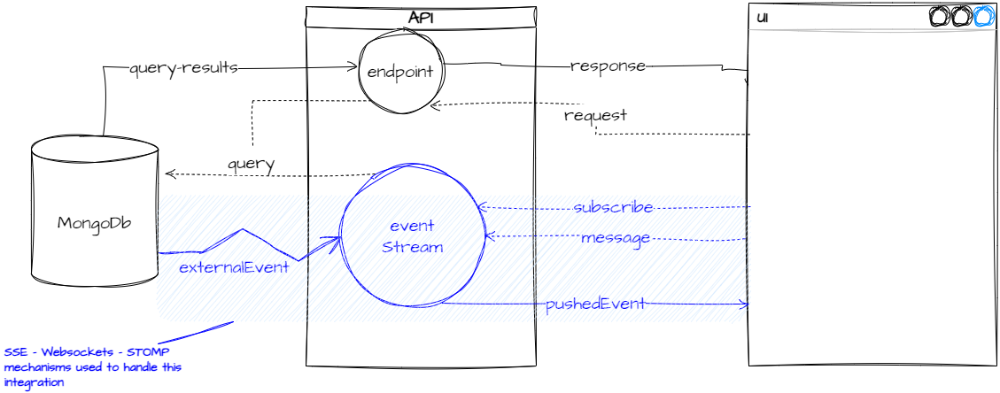

# Project tryout-websockets

A key part of an event driven application design with microservices is sending/triggering and recieving events securely and efficiently. STOMP (**S**treaming **T**ext-**O**rientated **M**essaging **P**rotocol) is a message format protocol often used with websockets to send and receive messages between pariticipating services and layers. The illustration shows the kind of architecture often built and used.  
  
  

The exhibits in this repo will build out a series of projects leading to a full scale secure application that will be the reference architecture for other applications

## [See Notes](./notes/readme.md)