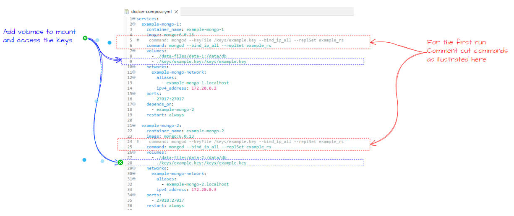
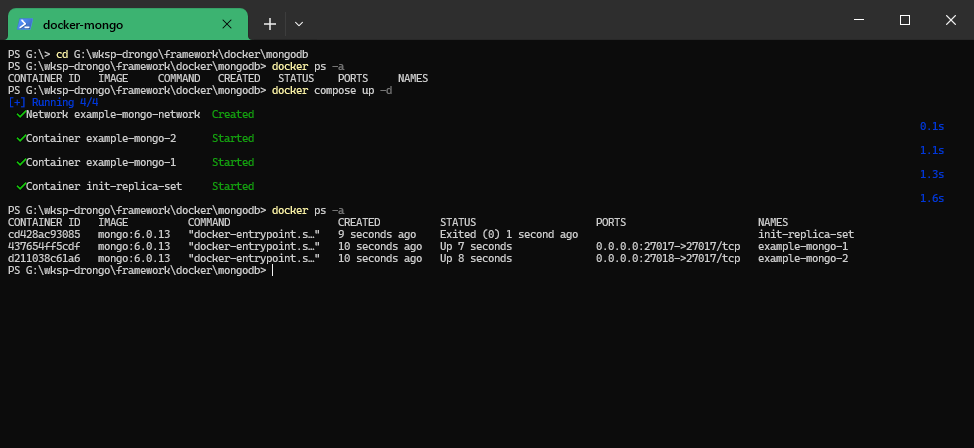

# Setting up Mongo
The docker compose project starts up a two node cluster in docker containers. However to ensure it is setup securely a few additional manual steps are needed.
  
  
## One time steps needed to setup keys and the admin account
Mongo uses a key-file for encryption purposes. This key-file has to be generated and than made available to Mongo. For this we will need to:-  
  **i.**    Generate the key-file  
  **ii.**   Update the docker-compose file to volume mount the generated key-file  
  **iii.**  Start up the containers, but without the key-file being used  
  **iv.**   Shell into one of the container and change the ownership and permissions on the volume mounted key-file  
  **v.**    Whilst in the container (from the previous step) run the mongosh-client and create the admin user  
  **vi.**   Exit the mongosh-client, the container and then shutdown  
  **vii.**  Start up the containers, but this time with the key-file used  
  **viii.** Shell into the container running the primary node. Login into the primary mongo instance then Test, load some data etc

### 1. Generate the key-file using open-ssl
`openssl rand -base64 -out example.key 756`  
  
  

### 2. Update the docker-compose.yml to volume mount the generated key-file
See the notes in blue in the illustration below  
  
### 3. Start up the containers, but without the key-file being used
See the notes in red in the illustration below to switch out the command to run without the key-file  

  

Then run `docker compose up -d` whilst in the folder where the ***docker-compose.yml*** file is located  
  
  

### 4. Change ownership and permissions on the key file from within the container
   
**i.** Shell into the container running the primary node `docker exec -it example-mongo-2 /bin/bash`<br/>

**ii.** Change the ownership `chown mongodb /keys/example.key`<br/>

**iv.** Change the permissions `chmod 600 /keys/example.key`<br/>

### 5. Create the mongodb user
**i.** From within the container start up the mongosh, the interactive cli `mongosh`  
  
  
**ii.** Create the user in admin database  
```bash
use admin
db.createUser(
  {
    user: "example_admin",
    pwd: passwordPrompt(), // or cleartext password
    roles: [
      { role: "userAdminAnyDatabase", db: "admin" },
      { role: "readWriteAnyDatabase", db: "admin" },
	   { role: "dbAdminAnyDatabase"  , db: "admin" },
	   { role: "clusterAdmin"        , db: "admin" }      
    ]
  }
)
```
When executing above, you will get prompted to provide a password  
  

### 6. Shutdown the cluster
**i.** exit the container  
**ii.** then run  `docker compose down`  
   
### 7. Switch back the start up command in the docker compose file
  

### 8. start up the cluster
   (See 3.above)

### 9. login with the new admin user account
**i.** Shell into the container (see above)  
**ii.** Log into the db with mongosh `mongosh --authenticationDatabase "admin" -u "example_admin" -p "*************"`

## Useful Resources
**i.**  [mongodb manuals](https://www.mongodb.com/docs/manual/tutorial/configure-scram-client-authentication/)  
**ii.** To enable authentication on a replica set [see this](https://www.mongodb.com/docs/manual/tutorial/enforce-keyfile-access-control-in-existing-replica-set/)


