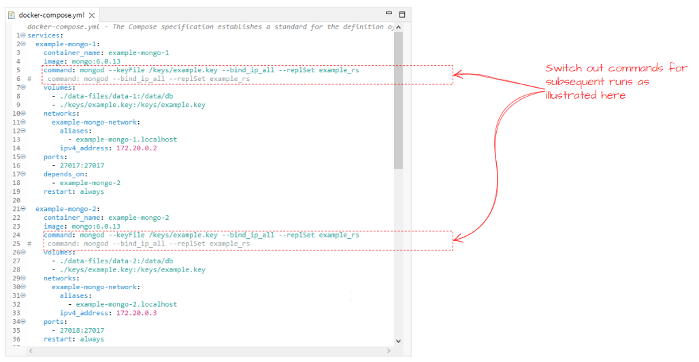

## Setting up Authentication

### Useful Resources
[mongodb manuals](https://www.mongodb.com/docs/manual/tutorial/configure-scram-client-authentication/)


### Authentication Cookbook

To enable authentication on a replica set [see this](https://www.mongodb.com/docs/manual/tutorial/enforce-keyfile-access-control-in-existing-replica-set/)

Basic steps are

### 1. Generate the keys using open-ssl
`openssl rand -base64 -out example.key 756` <br/>


### 2. Update the docker-compose.yml 
Two updates are needed<br/>
**i.** volume mapping to make the keys are available to the containers<br/>
**ii.** switch out the mongo commands when running first time<br/>
<br/>

### 3. Startup mongodb first time to setup cluster
**i.** select the folder where the docker compose file resides `cd <path_to_workspace>/framework/docker/mongodb`<br/>
   <br/>
   
**ii.** run `docker compose up -d`
   

### 4. Change ownership and permissions on the key file from within the container
   
**i.** Shell into the container running the primary node `docker exec -it example-mongo-2 /bin/bash`<br/>

**ii.** Change the ownership `chown mongodb /keys/example.key`<br/>

**iv.** Change the permissions `chmod 600 /keys/example.key`<br/>
  
   
### 5. Create the mongodb user
**i.** From within the container start up the mongosh, the interactive cli `mongosh`<br/>
<br/>

**ii.** Create the user in admin database<br/>
```bash
use admin
db.createUser(
  {
    user: "example_admin",
    pwd: passwordPrompt(), // or cleartext password
    roles: [
      { role: "userAdminAnyDatabase", db: "admin" },
      { role: "readWriteAnyDatabase", db: "admin" },
	   { role: "dbAdminAnyDatabase"  , db: "admin" },
	   { role: "clusterAdmin"        , db: "admin" }      
    ]
  }
)
```
When executing above, you will get prompted to provide a password<br/>


### 6. Shutdown the cluster
   6.1 exit the container
   6.2 `docker compose down`
   
### 7. Switch back the start up command in the docker compose file
  

### 8. start up the cluster
   (See 3.above)

### 9. login with the new admin user account
   9.1  Shell into the container (see 4i. above)
   9.2  Log into the db with mongosh `mongosh --authenticationDatabase "admin" -u "example_admin" -p "*************"`


