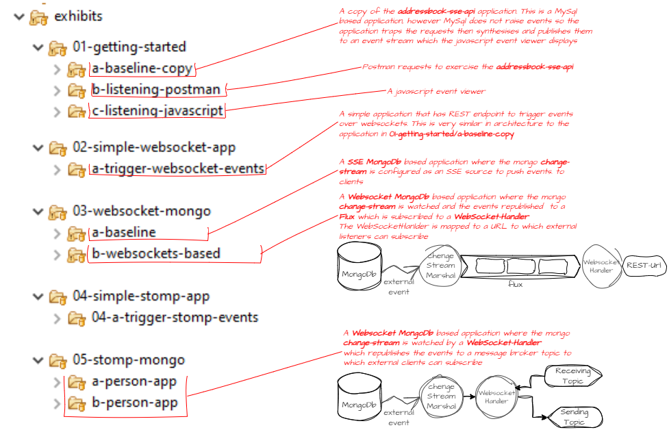

[Home](../README.md)

# Notes

## Repository Structure

## Docker
Contains docker compose projects to start up databases

## Exhibits
The folder contains a graded set of projects to explore and develop a particular aspect towards building the objective as given in the [Project Overview](../README.md)
  
  

## [Setting up MongoDb](docker/mongodb/readme.md)
MongoDb has to be setup as a cluster to be able to leverage the change-stream feature which is needed to capture data changes as events in a java application. The docker compose project does this, but to secure it the setup is a little convoluted and requires some one time manual steps.
  

  
## Resources and references

### Stomp related learning resources on the web
1. [Using Spring Boot for WebSocket Implementation with STOMP](https://www.toptal.com/java/stomp-spring-boot-websocket)
2. [Spring Boot Websocket STOMP Example](https://niels.nu/blog/2017/spring-boot-websocket-client)

### Useful guide to running stuff at startup in Spring Boot
[Guide to running logic on startup in spring](https://www.baeldung.com/running-setup-logic-on-startup-in-spring)

### Websocket Security
1. [spring official documentation on websocket security](https://docs.spring.io/spring-security/reference/servlet/integrations/websocket.html#websocket-authorization)
2. [A very useful stackoverflow response](https://stackoverflow.com/questions/48903044/how-to-secure-websocket-application-spring-boot-stomp)
3. [A dzone article with some good explanations](https://dzone.com/articles/build-a-secure-app-using-spring-boot-and-websocket)
4. [A Baeldung article](https://www.baeldung.com/spring-security-websockets)